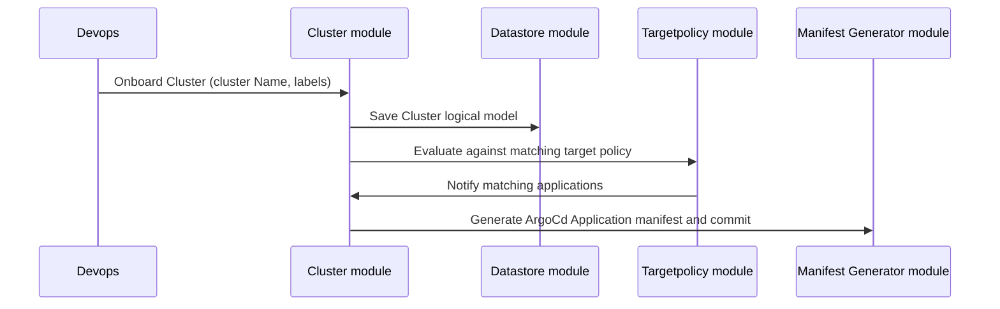
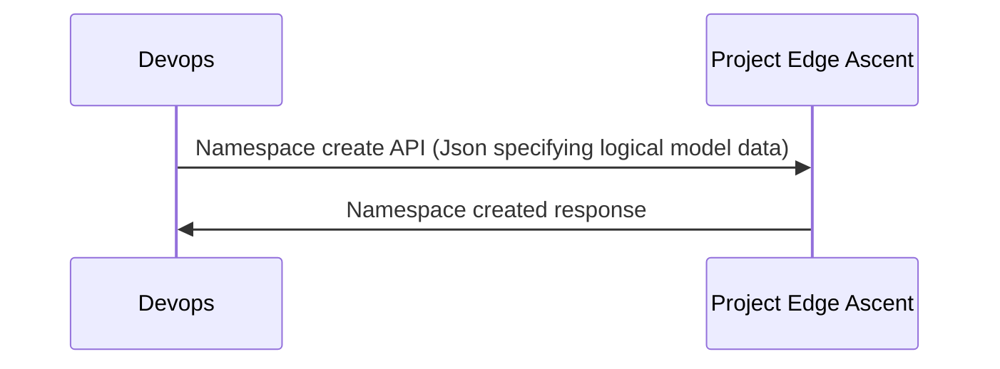
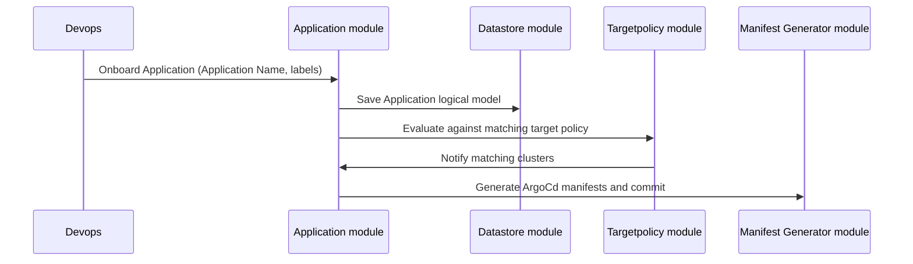
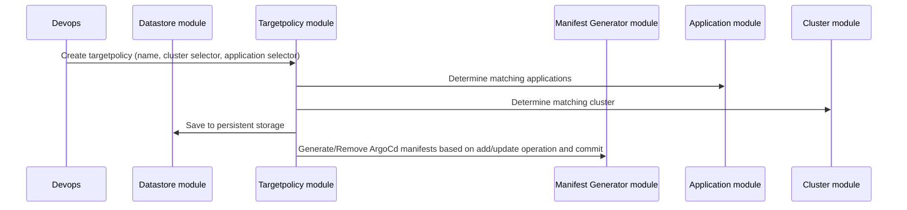

**Problem Statement**

Application deployments in distributed environments with many clusters have always been troublesome. This includes cases like deployments at Edge machines spread over geographical regions or even deployments of various components of distributed applications across co-located but substantial number of clusters. Kubernetes as a tool has come up as de-facto choice for orchestrating these deployments in easy and readable YAML (Yet Another Markup Language)L based deployment descriptors and GitOps tools like Flux, ArgoCD, and Jenkins X have emerged as popular choices for automating the deployment and management of these Kubernetes application, while these patterns work well for small number of clusters but the organization, configuration and scalability poses significant challenges with increasing number of clusters. A subset of these challenges is as below 

- Determining Application State and Deployment Locations: As the ultimate source of truth, the GitOps manifests become difficult to manage and review manually at scale. Manually examining these manifests becomes impractical, and in disconnected edge situations, the GitOps manifests may not accurately represent the actual state of applications, as edges do not report signals to a central source. 

- Tracking Application Deployment History: Understanding the reasons behind an application's deployment in a specific cluster and tracking its chronological deployment history becomes complex 

- Lack of Centralized View of Deployments and Rollbacks: There is a lack of a centralized view of version deployments activities across multiple clusters 

- Efficient Inventory reporting: Efficient and effortless way to gather inventory information 

- Ensuring Application Dependencies and Health: Ensuring that application dependencies are running and healthy before starting a deployment requires a defined and effective approach. 

While there are some commercial tools which do a part of the above requirements, they are too expensive and difficult to customize. The requirements force to think of having a software component that would provide below features 

- Metadata based targeting for applications and cluster combination, to allow users to select clusters based on labels (say deploy all analytics applications on GPU clusters) 

- API based inventory information retrieval 

## **Solution**

To tackle these challenges effectively, we have developed an innovative application named **Project Edge Ascent: Moving from Complexity to Control** that operates on a logical data model stored in an inventory database. This logical data model serves as a representation of various resources of the edge, 
including Namespaces, Applications, and Clusters, along with their associated metadata. 
The Project Edge Ascent is a FastAPI-based application that exposes different API endpoints as listed in the legend above. We used ArgoCD as our choice of GitOps tool. 

High level architecture diagram of Project Edge Ascent application looks like below


This is how a **Application** logical model representation looks:

```
{
  "name": "app1",
  "description": "App 1",
  "repo_url": "https://dev.azure.com/repos/app_k8s",
  "repo_branch": "master",
  "repo_path": "manifest/app1",
  "metadata": {
    "common": "true",
     "gpu": "false",
     "name": "app1"
  },
  "namespace": "ieb"
}
```

The **repo_url** points to the actual kubernetes deployment manifest stored in the repositories. 

This is how a **Cluster** logical model representation looks:

```
{
  "name": "east-nsw-newcastle-01",
  "description": "Edge Store for App Deployment in East Australia",
  "shortName": "cluster1",
  "environment": "nonprod",
  "metadata": {
    "gpu": "true",
    "region": "east",
    "country": "Australia",
    "edge": "true",
    "name": "east-nsw-newcastle-01"
  }
}
```


We also introduced targeting mechanisms through the **TargetPolicy** logical model, thus administrators can now use metadata-based selectors to determine which applications should be deployed on specific clusters with specific metadata attributes. The Project Edge Ascent ensures that the chronological order of deployments is maintained, providing a clear deployment history. The Project Edge Ascent also generates the respective ArgoCD manifests for each cluster and does all the management for us. 


This is how a **TargetPolicy** logical model representation looks:


```
{
  "name": "app1_to_east",
  "app_selector": {
    "common": "true"
  },
  "cluster_selector": {
    "region": "east"
  }
}
```

As we can see the TargetPolicy above states that deploy all apps having labels **common:true** to all clusters having metadata labels **region:east**.


**Methodology**

This is how the process to deploy would look like :

1. Onboarding a Cluster



2. Apply the ArgoCD master manifest to the onboarded cluster manually for the first time.
3. Create a Namespace (aka Team) in the Project Edge Ascent. The namespace helps us abstract and help the isolation of environments and applications to ensure RBAC. This is not related to k8s namespace.



3. Onboard the Application


4. Create TargetPolicy to target applications on clusters using the app and cluster metadata. 

 
Thus you can deploy at scale by just tweaking the metadata of applications and clusters. 


**Observability**

To enhance observability, the team leverages ArgoCD metrics, which are fed into the Log Analytics Workspace through the AMA Agent. 

From there, the metrics are visualized using Azure Workbooks, offering valuable insights into the system's performance and operations. 
However, one significant challenge still remains the lack of a unified logical data model that is separate from the ArgoCD metrics data. 
This gap hinders a comprehensive understanding of the entire system and its relationships, making it difficult to gain holistic insights into the deployment process.

We can solve it using a unified data store/or dashboarding for logical models and metrics. 

**Authentication/Authorization**

This application should be designed to support multi-tenant clients. We expect that this will be deployed in shareable HA architecture. We would leverage Azure AD for authentication and Groups for Authorization. Using groups for Authorization offers easy maintenance of users and easy implementation of RBAC. 

There are primarily three places where authorization plays critical role 
- AuthN/AuthZ for Rest API's and clear segregation of who can do what. We used contributor role for users to be able to do create/delete and update and reader role for list and get API's
- Controlling which groups are entitled to operate on namespace. As you would have noticed that each application has to be deployed in a namespace, it is important to specify users from which group will be allowed to deploy application in a namespace.
- Controlling access to namespace though kubectl command. Since we already have information on what groups should be allowed on namespace we can use kubernetes role based access control to restrict namespaces to group id(s)

**Conclusion**

This small application would allow users to deploy applications based on labels to the clusters using cluster metadata. It takes care of all important concerns like observability and security. At the same time it abstracts out the users from complexity of which cluster is where and they can just say "Deploy all Analytics apps to all GPU clusters in north America" by using selectors in targetpolicies


## Contributing

This project welcomes contributions and suggestions.  Most contributions require you to agree to a
Contributor License Agreement (CLA) declaring that you have the right to, and actually do, grant us
the rights to use your contribution. For details, visit https://cla.opensource.microsoft.com.

When you submit a pull request, a CLA bot will automatically determine whether you need to provide
a CLA and decorate the PR appropriately (e.g., status check, comment). Simply follow the instructions
provided by the bot. You will only need to do this once across all repos using our CLA.

This project has adopted the [Microsoft Open Source Code of Conduct](https://opensource.microsoft.com/codeofconduct/).
For more information see the [Code of Conduct FAQ](https://opensource.microsoft.com/codeofconduct/faq/) or
contact [opencode@microsoft.com](mailto:opencode@microsoft.com) with any additional questions or comments.

## Trademarks

This project may contain trademarks or logos for projects, products, or services. Authorized use of Microsoft 
trademarks or logos is subject to and must follow 
[Microsoft's Trademark & Brand Guidelines](https://www.microsoft.com/en-us/legal/intellectualproperty/trademarks/usage/general).
Use of Microsoft trademarks or logos in modified versions of this project must not cause confusion or imply Microsoft sponsorship.
Any use of third-party trademarks or logos are subject to those third-party's policies.
